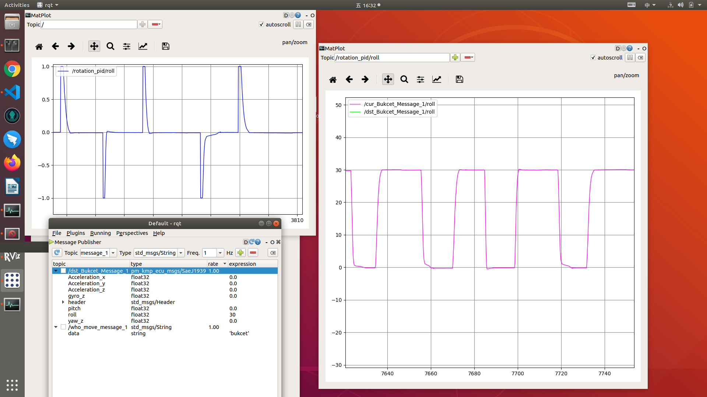

# pid调参
不同的设备，为了达到预想的运动控制，配置的ｐｉｄ参数是不同的。因此ｐｉｄ调参，是ｐｉｄ算法实施不可或缺的一个步骤。
调参，最好能看曲线调参，包括：ｐｉｄ输出，控制目标运动反馈信息，如下图



调参的时候，先调参数ｐ，再调参数ｉ,再调参数ｄ。\
采样间隔也需要设置，间隔太小资源浪费，间隔太大反应迟钝。\
采样输出采用－１到１
```
from simple_pid import PID
self.pid_bukcet = PID(0.05, 0.00009, 0.001, setpoint=0)
self.pid_bukcet.output_limits = (-1, 1)
self.pid_bukcet.sample_time  = 0.05
```
把ｐｉｄ输出映射到实际控制参数
```
pid_output_info = Global.pid_module.update()
Global.bukcet_value =  pid_output_info["bukcet_pid_output"]

if Global.bukcet_value > 0:
    Global.bukcet_value = 600 * Global.bukcet_value + 290
elif Global.bukcet_value < 0:
    Global.bukcet_value = 600 * Global.bukcet_value - 290
```

- 调节ｐ时，最佳效果是一步到位，没有往复抖动，有抖动就往小了调，直到抖动最小。ｐ从1.0开始往下调,每次除以２减小幅度,感觉快到时每次往下减０．ｘｘ1。ｐ低于最佳值后，会有调控缓慢的现象
- 调节完p,调节ｉ,i也是从１开始往下调，有抖动就往小了调，直到一步到位，抖动最小。ｉ可以让最佳ｐ值后的抖动尽快归零。ｉ值比其最佳值过大时会抖动厉害，比其最佳值过小时基本和只有最佳ｐ效果类似
- 调节完ｉ,再调ｄ，ｉ其实会导致调好的ｐ运动过位，引起抖动。这时ｄ就是弥补ｉ的抖动。ｄ下调到一步到位前弯弧最小，ｄ决定弯弧高度竖直轴高度。ｄ过大基本导致反应缓慢，ｄ过小也会反应缓慢
  
p就是调节力度速度的，反应快慢，选择合适的速度。
ｉ就是让ｐ产生的震动快速回位的，一般这样的图比较合适


ｄ就是在快到目的前，急速刹车

```
self.pid_rotator = PID(0.04, 0.0000001, 0.02, setpoint=0)
self.pid_rotator.output_limits = (-1, 1)
self.pid_rotator.sample_time  = 0.05
```
```
if Global.rotator_value > 0.020:
    Global.rotator_value = -600 * Global.rotator_value - 400
elif Global.rotator_value < -0.020:
    Global.rotator_value = -600 * Global.rotator_value + 400
else:
    Global.rotator_value = 0
```
参数不是关键，实际控制效果才是关键

p要求比较大，ｄ就要偏大