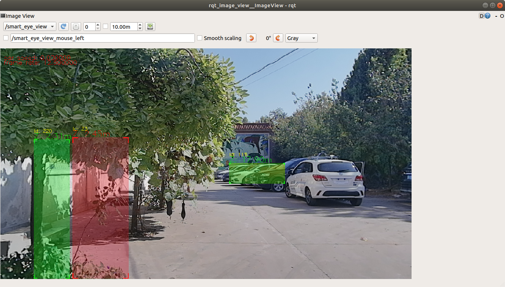

# 双目摄像头smart_eye驱动包
## 系统环境
- tx2 jetpack 开发环境
- opencv 3.4.1
- ros melodic
- smart_eye SDK

## User Guide
### installation
#### opencv install
下载版本3.4.1 \
[opencv下载地址](https://opencv.org/releases/)\
解压文件\
```unzip opencv-3.4.1.zip```\
进入解压后的文件夹，创建build文件夹\
```mkdir build ```\
创建安装目录\
```mkdir install```\
进入build文件夹\
```cd build```\
cmake
``` 
cmake -D CMAKE_BUILD_TYPE=Release \
-D CMAKE_INSTALL_PREFIX=opencv所放的位置（/home/promote/Document）/opencv-3.4.1/install \
-DBUILD_opencv_cudacodec=OFF ..
```
编译\
``` make -j8```\
安装\
``` sudo make install ```

### smart_eye SDK
把制造商提供的存放.so文件夹sdk放在 ros环境目录(catkin_ws/src)/smart_eye 目录下面，这些在驱动包里面已经存放好了，这一步可跳过
### 驱动包
- U盘拷贝，存放到ros环境目录下
### ros驱动运行
假设驱动包路径为：～/catkin_ws/src/smart_eye.(根据个人存放位置更改)\
编辑～/catkin_ws/src/smart_eye/src/CMakeLists.txt文件\
找到下面这句
```
SET(OpenCV_DIR "/home/pmjd/Documents/opencv-3.4.1/install/share/OpenCV")
find_package(OpenCV 3.4.1 REQUIRED)
```
把SET(OpenCV_DIR "/home/pmjd/Documents/opencv-3.4.1/install/share/OpenCV") 里的“/home/pmjd/Documents”更改为自己的opencv存放位置\
编译\
```cd ~/catkin_ws && catkin_make```\
运行
- 环境配置  ```export LD_LIBRARY_PATH=～/catkin_ws/src/smart_eye/sdk:$LD_LIBRARY_PATH```\
这里“～/catkin_ws/src/smart_eye”根据个人存放位置更改
- ```source devel/setup.bash && rosrun smart_eye DisplayCompound```

### 应用
节点发出两个topic：/detect_array 和 /smart_eye_view\
- /smart_eye_view 是 sensor_msgs::Image消息类型
- /detect_array 是自定义消息类型

/detect_array
```
    detect[] detect_array
```
/detect
```
    int64 stateLabel //图像上显示的id
	int64 CIPV
	int64 trackID 
	int64 trackFrameNum
	int64 obstacleType
	float32 real3DRightX //物体右侧距离观光车摄像机的x方向距离
	float32 real3DLeftX //物体左侧距离观光车摄像机的x方向距离
	float32 width 
	float32 real3DLowY 
	float32 real3DUpY
	float32 height 
	float32 HMW
	float32 fuzzyCollisionTimeZ
	float32 longitudinalZ  //距离观光车的z方向距离
	float32 speedOfLongitudinal
	float32 lateralX
	float32 speedOfLateral
	float32 currentSpeed
```

打开rqt_image_view\
```rqt_image_view```\
订阅topic smart_eye_view\



