## 环境要求

* Ubuntu 18.04
* Cuda 10.0
* ROS melodic
* Qt5


## 软件环境部署

### QT安装　

* sudo apt-get install qttools5-dev-tools libqt5svg5-dev qtmultimedia5-dev

## ROS melodic 安装

[ROS官网](http://wiki.ros.org/melodic/Installation/Ubuntu)

### Cuda10.0 ，cudnn安装

[安装指南](https://www.cnblogs.com/journeyonmyway/p/10316292.html)

把程序包里的`radar`文件夹拷贝到本地


在此目录下，执行`catkin_make` 指令


编译完成后，指令输入

```bash
sudo ip link set can0 up type can bitrate 500000
roslaunch ars_40X ars_40X.launch
```

在设备链接正常的情况下就可看到输出


## ARS404的应用

```bash
cansend can0 200#F8000000089C0000 // Objects detection with all extended properties
cansend can0 200#F8000000109C0000 // Clusters detection with all extended properties
```

这两条指令分别启动radar的 Cluster模式和Object模式，我们使用Object模式

毫米波雷达数据读取，我们使用`ars_40X`程序

数据显示和图像显示，我们使用`ros2qt` 程序

图像物体识别，我们使用`vision_darknet_detect` 程序

## 毫米波和图像的融合

* 首先对摄像头进行标定
* 获取内参矩阵
* 通过内参矩阵把毫米波数据映射到图像上
* 通过yolo识别，并筛选出物体距离，如下图

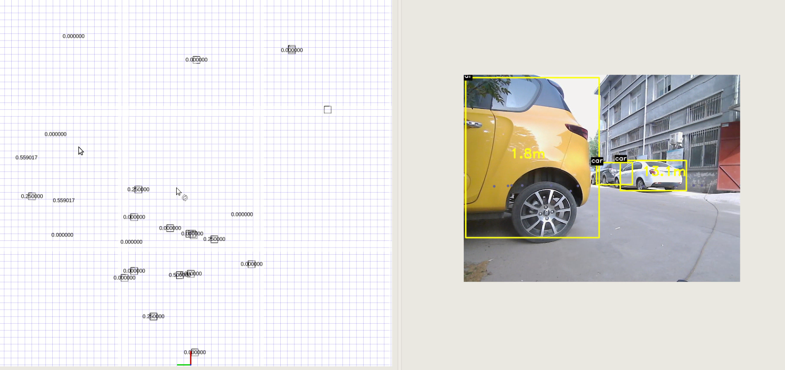

## 摄像头标定

摄像头标定可以使用opencv提供的标定方法，也可以使用matlab提供的摄像头标定插件。

我们介绍下matlab摄像头标定方法。为了方便标定，我们制作了两个”标定盒子”


通过该摄像头依次采集如下位置图片位于image文件夹

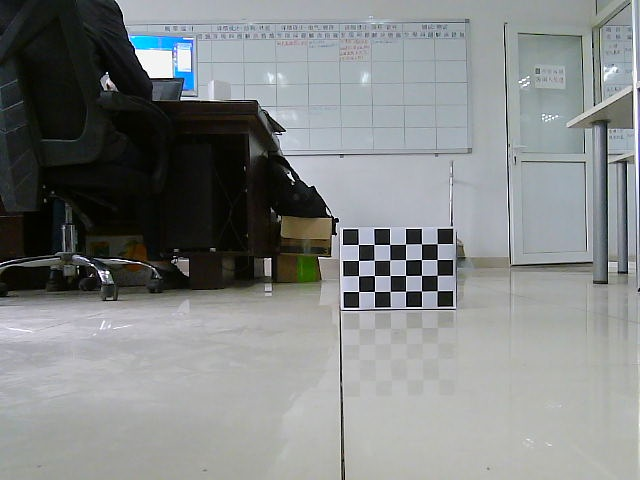


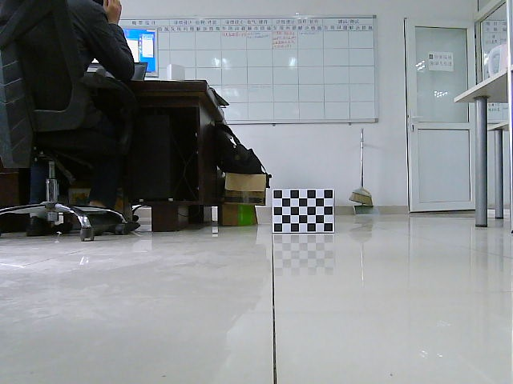


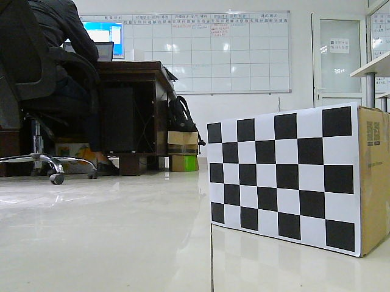

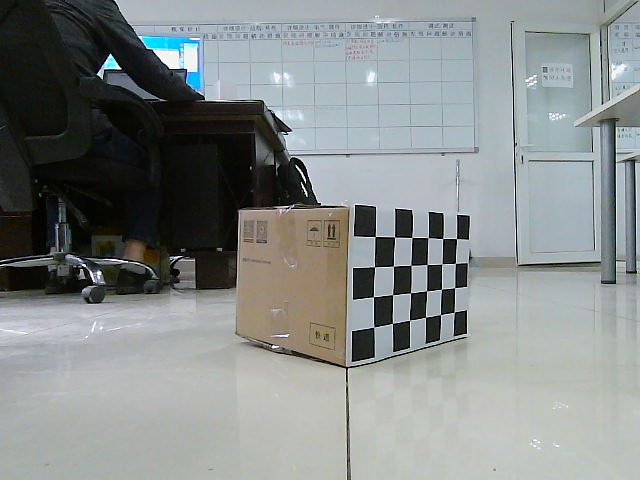


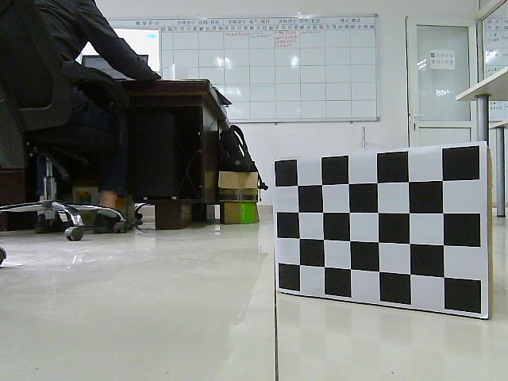


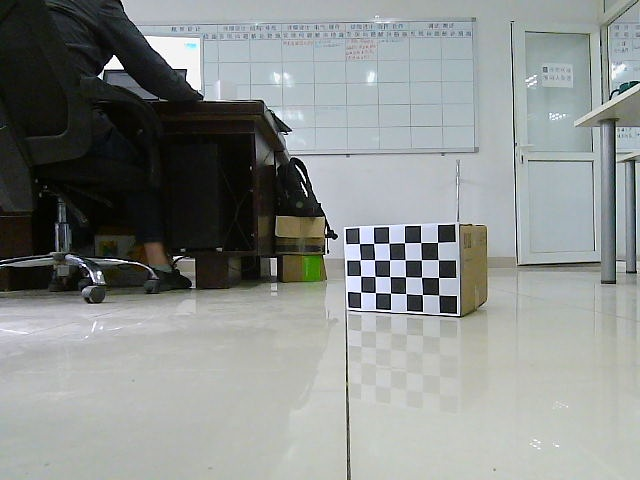


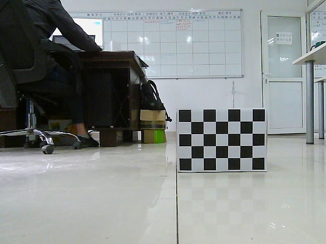


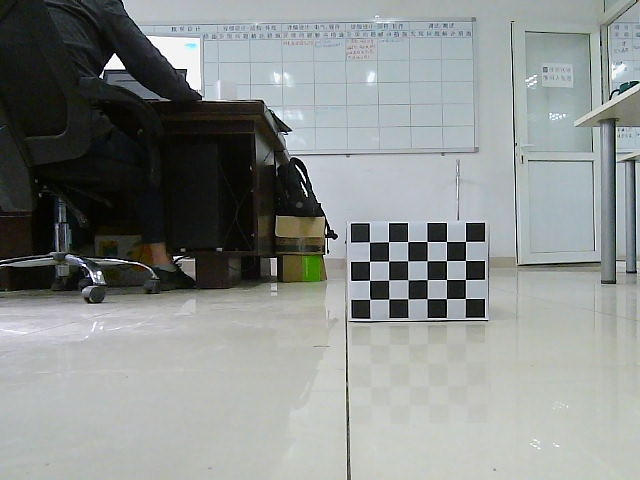

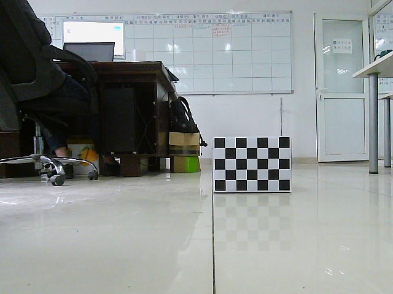

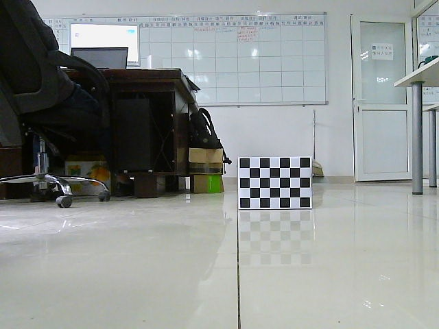

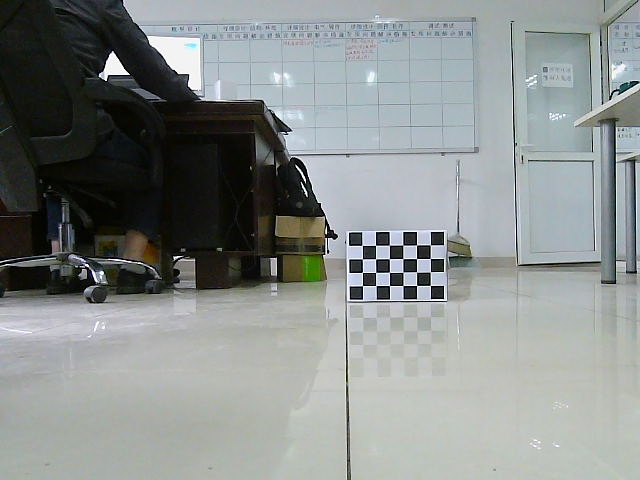


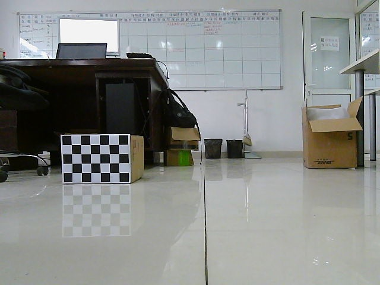


在matlab 应用程序下找到Camera Calibration工具箱


加载待标定的图像


填写棋盘格每个格子边长的真实值


可以预览成功检测出棋盘格的图像，然后开始标定，点击Calibrate

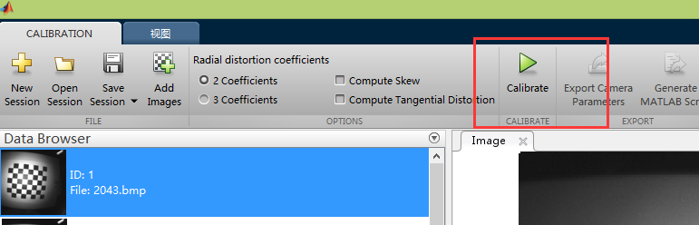

平均误差小于0.5即可


导出相机标定参数


我们只需要用到 **IntrinsicMatrix**

```cpp
cv::Point World2Image(Eigen::Vector3d Pw)
{
  static Eigen::Matrix3d intric = (Eigen::Matrix3d() << 465.2203, 0, 351.1325, 0, 463.8023, 256.4198, 0, 0, 1).finished();
  static Eigen::Matrix3d mi = (Eigen::Matrix3d() << 1, 0, 0, 0, -1,0, 0, 0, 1).finished();
  Pw = mi*Pw;
  Eigen::VectorXd result(2);
  result = intric*Pw/Pw.z();
  cv::Point P (result(0),result(1));
  return P;
}
```

通过world2image函数把毫米波坐标系转换到图像坐标系

这样在图像中，我们就有了深度信息。

然后再通过yolo的darknet进行物体识别，就可得到，障碍物的类别和距离信息。

## darknet

[Yolo物体检测](https://pjreddie.com/darknet/yolo/)

我们在程序里使用了yolo v3进行物体识别
